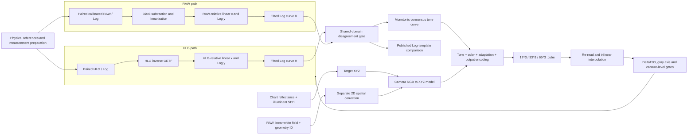

# Log-LUT Reconstruction

`log-lut-reconstruction` reconstructs an undocumented camera Log response and turns it into a chart-validated, deployable `.cube` LUT. Spectral targets and RAW flat-field calibration are supporting measurements that keep Log and LUT errors from being confused with illumination or chart-reference errors.

The main sequence is:

1. classify black, controlled-exposure, local-gradient and paired-transfer measurements;
2. apply the selective flat-field policy to the measured axis without modifying Log codes;
3. independently reconstruct HLG-Log and calibrated RAW-Log responses;
4. compare that empirical response against published Log shape families under equal fitting freedom;
5. apply geometry-bound 2D correction to linear chart imagery before LUT training;
6. export, re-read and benchmark the tone and color transform as a standard `.cube` 3D LUT.

The repository is an orchestration layer over three reusable component projects. It does not duplicate their algorithms and does not contain camera footage, vendor LUTs, commercial chart spectra, measured device spectra or device-specific coefficients.

## Log-to-LUT architecture



## Three-part code organization

| Part | Module | Public responsibility |
|---|---|---|
| 1. HLG | `hlg_path.py` | Invert the standard HLG OETF and fit HLG-relative-linear values to Log codes |
| 2. RAW | `raw_path.py` | Fit calibrated RAW relative-linear values directly to Log codes; no HLG input |
| 3. Integration | `integration.py` | Call both paths, measure shared-domain disagreement and build the monotonic consensus |

The production orchestrator calls `reconstruct_dual_path()` from the integration module. The two single-path functions remain independently testable and reusable.

## Technical contributions

### 1. Two independent linearization paths become a measurable consistency test

The HLG-Log route derives its linear axis from the standardized HLG inverse OETF. The RAW-Log route receives an independently calibrated RAW relative-linear exposure axis after black subtraction, linearization, exposure normalization and the selected spatial policy. Neither route calls the other. The integration module samples both fitted curves on a shared domain, records their disagreement and constructs a monotonic consensus.

### 2. Spatial and color transforms remain separate by construction

A flat field depends on image position `(x, y)`, while a standard 3D LUT depends only on encoded `(R, G, B)`. Controlled-exposure points receive a RAW-linear factor on `x` only; black anchors, local white gradients and same-position HLG/Log pairs bypass flat field. Actual chart images are spatially corrected in the linear domain before patch sampling and LUT training, with a required geometry identifier.

### 3. Chart calibration supports the Log-to-LUT claim

Chart reflectance and illuminant SPD produce target XYZ. Those targets supervise the color model, but validation continues through `.cube` export, file re-read and trilinear interpolation. The reported error therefore describes the deployed artifact rather than only an in-memory fit.

### 4. Quality gates encode the scientific validity range

Each stage emits a metric and threshold: white-field residual, static CCM DeltaE00, two Log-fit RMSE values, cross-method disagreement, final-LUT DeltaE00 and gray-axis monotonicity. A run is marked failed when any required gate fails, even if another stage has a low training error.

### 5. Every output is traceable

The final provenance manifest records SHA-256 hashes, sizes, configuration identity and pipeline status. Results can be compared without confusing a regenerated LUT with the artifact that was actually evaluated.

### 6. Public Log templates are compared under equal freedom

The template registry includes DJI D-Log, Insta360 I-Log, OPPO O-Log2, ARRI LogC4, Sony S-Log3 and Panasonic V-Log. Every candidate receives the same input-scale and output-gain freedom, optional offset policy and complete-capture holdout rule. Pairwise fitted-curve differences are reported so numerically equivalent template families are not presented as uniquely identifiable camera formulas.

## Component projects

| Stage | Component | Responsibility |
|---|---|---|
| Transfer primitives | [`paired-log-reconstruction`](https://github.com/Hower-Lv/paired-log-reconstruction) | HLG inversion and base Log-template fitting |
| LUT deployment | [`chart-lut-builder`](https://github.com/Hower-Lv/chart-lut-builder) | tone/color composition, `.cube` export and final-file validation |
| Calibration support | [`spectral-color-calibrator`](https://github.com/Hower-Lv/spectral-color-calibrator) | spectral XYZ, flat field, CCM and DeltaE00 targets |

## Installation

The `full` extra installs the three component projects directly from their public repositories:

```powershell
python -m pip install -e ".[full,dev]"
```

## Data-free end-to-end run

```powershell
log-lut-reconstruction synthetic `
  --config configs/synthetic.toml `
  --output outputs/synthetic
```

or:

```powershell
python examples/run_synthetic.py
```

The synthetic run uses smooth reflectance spectra, a measured-illuminant analogue, a per-channel 2D gain field, paired HLG/Log observations and repeated chart captures. It writes:

- `synthetic_target_xyz.csv`;
- `synthetic_tone_consensus.csv`;
- `synthetic_measurement_policy.csv`;
- `synthetic_camera_log_to_srgb.cube`;
- `pipeline_report.json`;
- `provenance.json`.

Synthetic accuracy verifies integration, domain accounting and artifact validation. It is not a claim about a specific camera.
The default example uses a 65-cube grid because the quality gate evaluates the re-read file after trilinear interpolation, not only the in-memory transform.

## Published Log-template comparison

Input CSV:

```text
linear,encoded,capture_id,measurement_kind,spatial_factor
0.000,64.0,black,black_anchor,1.0
0.010,220.0,capture_1,controlled_exposure,0.86
0.180,410.0,capture_2,local_white_gradient,1.0
0.320,520.0,capture_3,paired_transfer,1.0
```

Run all registered templates with complete-capture holdout validation:

```powershell
log-lut-reconstruction compare-templates `
  --samples measured_log_pairs.csv `
  --fit-offset `
  --output outputs/template_comparison.json
```

The report contains fitted scale/gain parameters, training RMSE, leave-group-out RMSE and pairwise maximum curve differences over the measured domain. A low error means that a public function family describes the measurements; it does not prove that the camera internally uses that manufacturer's OETF.

The optional `measurement_kind` and `spatial_factor` columns activate the selective policy. Without them, samples default to same-position paired measurements and remain unchanged. Use `--fit-offset` for native code coordinates with a non-zero black code; omit it for a black-subtracted encoded axis. The full contract and LUT-stage distinction are documented in [`docs/selective_flat_field_policy_zh.md`](docs/selective_flat_field_policy_zh.md).

Formula references, fitting freedom and identifiability boundaries are documented in [`docs/public_log_templates_zh.md`](docs/public_log_templates_zh.md).

A data-free example is included:

```powershell
python examples/compare_public_templates.py
```

## LUT image and color comparison

The integrated CLI exposes the component project's PMCC LUT gallery:

```powershell
log-lut-reconstruction lut-gallery `
  --image input_log_frame.jpg `
  --lut-dir local_luts `
  --corners pmcc_corners.json `
  --targets pmcc_target_xyz.csv `
  --source-encoding "D-Log M" `
  --output outputs/lut_gallery
```

It applies every local `.cube`, samples the central half-width area of each chart patch, writes comparison images and reports per-patch and aggregate DeltaE00. LUTs whose declared input encoding matches the source can enter the ranking. Cross-vendor LUTs with incompatible Log input remain visible as diagnostic outputs but are excluded from the valid color-accuracy ranking.

## Scientific boundaries

- HLG provides a standardized relative scene-linear coordinate, not sensor electron counts or absolute radiometry.
- The RAW path is valid only after black subtraction, linearization, spatial policy and exposure-axis normalization have been independently established.
- A channel-separable tone curve cannot represent local tone mapping, hue-dependent processing or temporal denoising.
- A CCM or LUT trained under one illuminant and exposure range is not automatically valid elsewhere.
- Public template ranking identifies shape agreement only inside the measured domain.
- A LUT requiring another vendor's Log encoding cannot be fairly ranked on unconverted D-Log M input.
- Commercial spectra, footage and vendor LUTs require separate redistribution permission.

Detailed architecture and claim boundaries are documented in [`docs/architecture_zh.md`](docs/architecture_zh.md).

## License

MIT
