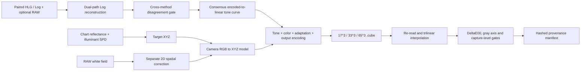

# Log-LUT Reconstruction

`log-lut-reconstruction` reconstructs an undocumented camera Log response and turns it into a chart-validated, deployable `.cube` LUT. Spectral targets and RAW flat-field calibration are supporting measurements that keep Log and LUT errors from being confused with illumination or chart-reference errors.

The main sequence is:

1. reconstruct a relative-linear-to-Log relationship from paired HLG/Log and optional RAW samples;
2. attach chart-derived color targets and an explicitly separate spatial correction;
3. export the tone and color transform as a standard `.cube` 3D LUT;
4. re-read the final file and validate DeltaE00, gray-axis behavior and capture-level generalization.

The repository is an orchestration layer over three reusable component projects. It does not duplicate their algorithms and does not contain camera footage, vendor LUTs, commercial chart spectra, measured device spectra or device-specific coefficients.

## Log-to-LUT architecture



## Technical contributions

### 1. Two independent linearization paths become a measurable consistency test

The HLG-Log route and the RAW-HLG common-front-end route estimate the same target Log response from different assumptions. The pipeline does not silently choose one. It samples both fitted curves on a shared relative-linear axis, records their disagreement and constructs a monotonic consensus curve only inside an explicitly measured domain.

### 2. Spatial and color transforms remain separate by construction

A flat field depends on image position `(x, y)`, while a standard 3D LUT depends only on encoded `(R, G, B)`. The orchestrator therefore treats the 2D field as an upstream artifact and prevents it from being hidden inside a color LUT claim.

### 3. Chart calibration supports the Log-to-LUT claim

Chart reflectance and illuminant SPD produce target XYZ. Those targets supervise the color model, but validation continues through `.cube` export, file re-read and trilinear interpolation. The reported error therefore describes the deployed artifact rather than only an in-memory fit.

### 4. Quality gates encode the scientific validity range

Each stage emits a metric and threshold: white-field residual, static CCM DeltaE00, two Log-fit RMSE values, cross-method disagreement, final-LUT DeltaE00 and gray-axis monotonicity. A run is marked failed when any required gate fails, even if another stage has a low training error.

### 5. Every output is traceable

The final provenance manifest records SHA-256 hashes, sizes, configuration identity and pipeline status. Results can be compared without confusing a regenerated LUT with the artifact that was actually evaluated.

## Component projects

| Stage | Component | Responsibility |
|---|---|---|
| Transfer reconstruction | [`paired-log-reconstruction`](https://github.com/Hower-Lv/paired-log-reconstruction) | HLG inversion, RAW-HLG alignment and unknown Log fitting |
| LUT deployment | [`chart-lut-builder`](https://github.com/Hower-Lv/chart-lut-builder) | tone/color composition, `.cube` export and final-file validation |
| Calibration support | [`spectral-color-calibrator`](https://github.com/Hower-Lv/spectral-color-calibrator) | spectral XYZ, flat field, CCM and DeltaE00 targets |

## Installation

The `full` extra installs the three component projects directly from their public repositories:

```powershell
python -m pip install -e ".[full,dev]"
```

## Data-free end-to-end run

```powershell
log-lut-reconstruction synthetic `
  --config configs/synthetic.toml `
  --output outputs/synthetic
```

or:

```powershell
python examples/run_synthetic.py
```

The synthetic run uses smooth reflectance spectra, a measured-illuminant analogue, a per-channel 2D gain field, paired HLG/Log observations and repeated chart captures. It writes:

- `synthetic_target_xyz.csv`;
- `synthetic_tone_consensus.csv`;
- `synthetic_camera_log_to_srgb.cube`;
- `pipeline_report.json`;
- `provenance.json`.

Synthetic accuracy verifies integration, domain accounting and artifact validation. It is not a claim about a specific camera.

## Scientific boundaries

- HLG provides a standardized relative scene-linear coordinate, not sensor electron counts or absolute radiometry.
- The RAW-HLG common-front-end route remains a hypothesis that must be tested with held-out scenes.
- A channel-separable tone curve cannot represent local tone mapping, hue-dependent processing or temporal denoising.
- A CCM or LUT trained under one illuminant and exposure range is not automatically valid elsewhere.
- Commercial spectra, footage and vendor LUTs require separate redistribution permission.

Detailed architecture and claim boundaries are documented in [`docs/architecture_zh.md`](docs/architecture_zh.md).

## License

MIT
